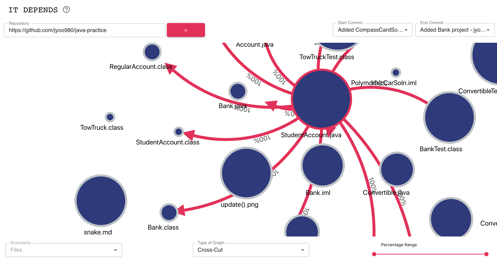

# it-depends 

This is a repository for it-depends. This tool enables developers to more easily visualize dependencies between
entities in a software system (classes, files, etc...) which cut across commit history. Development is currently in the 
early stages, so changes to this repo will be constant.

## Dependencies
* yarn (>= v1.17.3)
* tsc (>= 3.6.3)

## Working with it-depends
* To build: `yarn build`
* To execute all tests: `yarn test`

## Contributors

For a more detailed breakdown of contributions, please read [here](./contributors.md)

* [Sam Veloso](https://github.com/scveloso)
* [Slava Uryumtsev](https://github.com/uslava77)
* [David Li](https://github.com/daviidli)
* [Kiyomi KH](https://github.com/kiyomih)
* [James Yoo](https://github.com/jyoo980)
