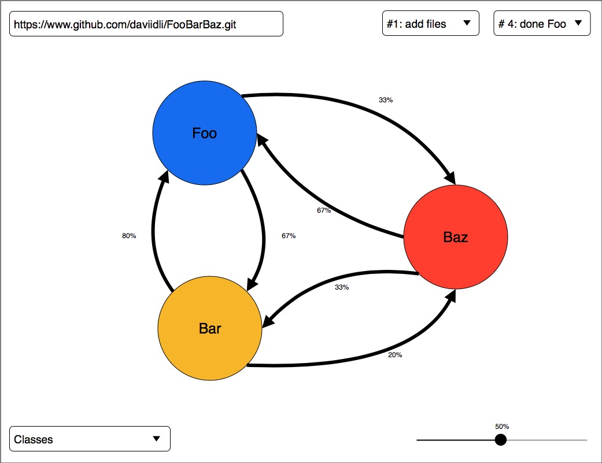
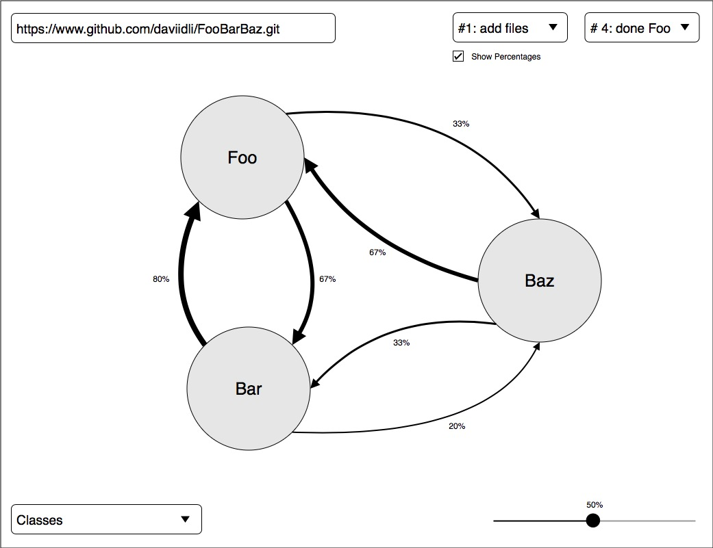

## The intent of our visualisation
Developers often encounter trouble traversing the information space of a large software system with extensive revision history. Looking through a list of commits is time-consuming, and fails to convey information in a form which efficiently communicates information about the system. In our project, we plan to create a visualization which makes it easier for developers and managers to understand the dependencies between entities in a software system across commits.

## The original design

Our initial prototype design was a graph-based visualization of dependencies in changes between files/classes across commits.
This included using various colours for different nodes, and using percentage labels on the edges to show the likelihood of changes in one node resulting in changes to another node. We considered possibly adding varying weights to the edges to also visually reflect this likelihood (see second picture), and tested the graph with and without varying edge weights in our prototype tests. For the dependency graph, these edges were labeled with the dependency type (e.g. association, dependency) to show the user what type of dependency relationship exists between two nodes.

Additionally, we provide the user with a way to choose which repository they want to visualize through a text box, a drop-down menu for selecting the start and end commits they want to visualize, a drop-down menu for the granularity of the visualization (e.g. file), and a slider to filter out percentage likelihood ranges.

## Prototype testing outcomes
For our user studies, we conducted a think-aloud, observational study on a white-boarded prototype of our design. The task assigned to users was to create a visualization using our ‘UI’, and determine which files were changed together more often than others.
The outcomes of our studies:

Pros: Users were able to quickly understand that nodes represented files/classes, and edges represented some type of correlation/ coupling between these nodes.

Cons: We found that users wanted to be able to locate the ‘help’ button more easily, and found certain elements of the UI, such as the buttons and the slider (for filtering) to be confusing. Additionally, they found varying colours of the nodes to be confusing, as it was unclear what the different colours represented. Finally, there was some concern around how cluttered the visualization could look when applied to a more complicated repository, particularly if only numbers are used to represent edge weights.

## Our new design

Based on what we observed in the user studies, we made several changes to our initial design:
* Updated the location of the help button so that the user could more easily locate it.
* We added labels to our slider and other buttons on the UI so there was no ambiguity as to what they were for.
* To try to address the issue of visual clutter, we updated the visualization so initially, only nodes are shown. Users are then able to interact with the graph to highlight edges by hovering over nodes, and also persist edges from nodes by clicking on nodes.
* We also updated the design so that the thickness of the edge represents the relative correlation in changes between files/ classes/ methods.
* We added different types of edges to visualize different types of dependencies in the dependency graph, so the user could more easily differentiate different types of dependency relationships.
* We updated the design to have a single colour for nodes, so as to not confuse the user.

## End user-study outcomes

After making the changes after our initial user studies, we ran an acceptance test. Here are some findings:
* User immediately jumped to click the “?” button when they were confused
* Initially confused with the large number of nodes that popped up
  * “Is there a way to filter nodes by size?”
* User enjoyed how node sizes helped to visualize the sizes of files.
* “It’ll probably take time to learn how to use this, but I think the visual aspect makes it easier for me to see what changed what, etc…”
* User wished for some kind of visual indicator which would make it clear that the app was processing a request, as opposed to having froze. 
  * Maybe future work would be to add QoL (Quality of Life) improvements
* “I like how fluid the UI is, stuff is bouncy yo”

